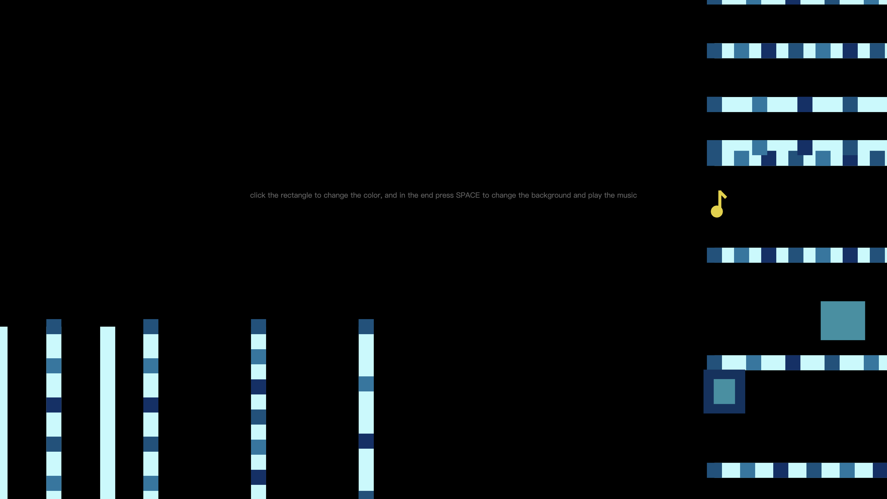
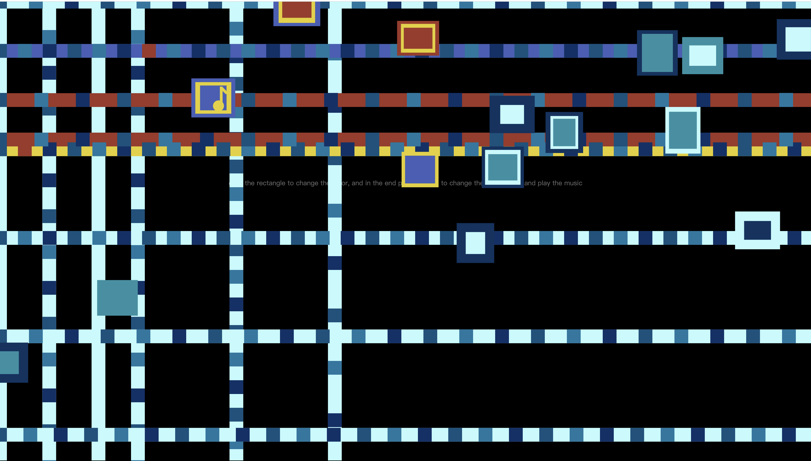
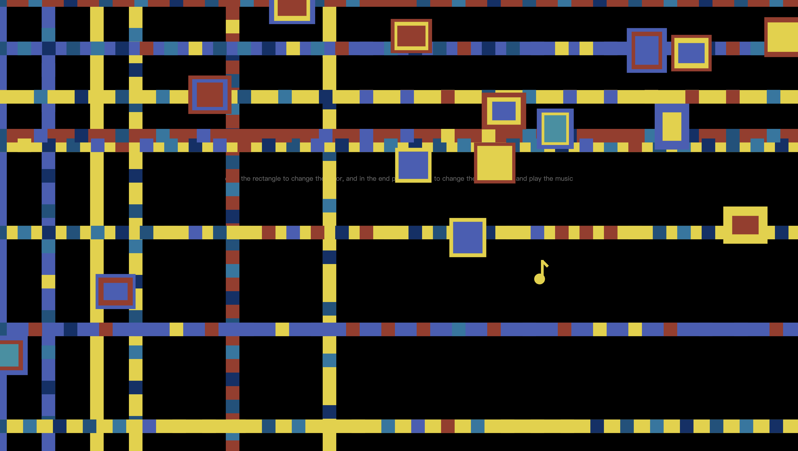
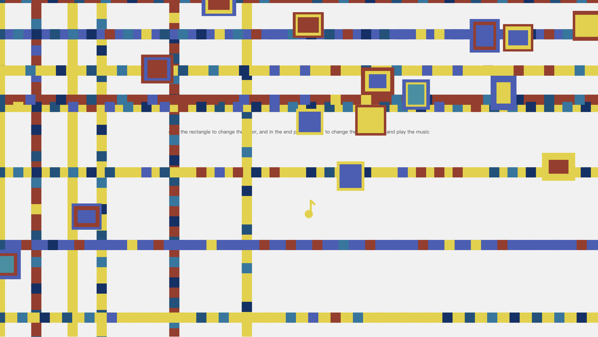

# hcai8120_9103_tut02_groupG_user-input

# brief introduction
Mondrian created this artwork inspired by the vibrant city lights and Broadway music on the streets of Manhattan, New York. So I think color and music are important elements of this work. My individual work started in the dark, simulating a city at night, but the musical-note-shaped mouse slowly changed the overall color of the work by clicking, from dark to bright. This transformation signifies that Broadway's music awakens the city, and it is music that revitalizes the nocturnal urban landscape.

# iteration
1. step1:At the beginning, the squares will move from the right and bottom to the center of the screen.

2. step2:When the mouse clicks on a block in the artwork, the color of the block will randomly change to any of the red, yellow, and blue colors in the original artwork， just like a city in the darkness gradually awakened by music.

3. step3:When all the square colors have changed, and the lines have completed their movement, users can click the SPACE to switch the background color from dark to white, at the same time, Broadway-style music will also sound and The vertical lines will begin to move left and right, representing the city being fully lit and full of vitality.
